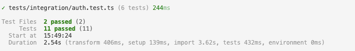
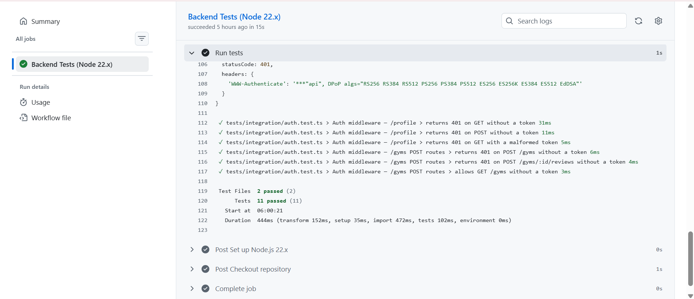
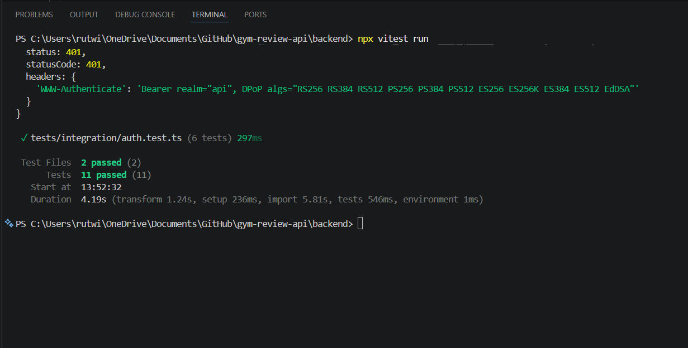

# Gym Review API

A REST API for browsing and reviewing gyms. Users can browse gyms publicly, and authenticated users can add new gyms and leave reviews.

---

## Tech Stack

- **Backend:** Node.js, Express, TypeScript
- **Auth:** Auth0 (JWT / RS256)
- **Testing:** Vitest, Supertest
- **CI/CD:** GitHub Actions
- **Frontend:** React 19, Vite, TypeScript, Auth0 React SDK

---

## Setup

### Clone the repository

```bash
git clone https://github.com/rut5/Gym-Review.git
cd Gym-Review
```

### Install dependencies

Backend:
```bash
cd backend
npm install
```

Frontend:
```bash
cd frontend
npm install
```

---

## Environment Variables

### Backend — `backend/.env`

```
PORT=4000
AUTH0_AUDIENCE=https://gym-review-api
AUTH0_ISSUER_BASE_URL=https://your-tenant.auth0.com
CLIENT_ORIGIN=http://localhost:5173
```

### Frontend — `frontend/.env`

```
VITE_AUTH0_DOMAIN=your-tenant.auth0.com
VITE_AUTH0_CLIENT_ID=your-client-id
VITE_AUTH0_AUDIENCE=https://gym-review-api
VITE_API_URL=http://localhost:4000
```

See `.env.example` in each folder for reference.

---

## Running Locally

Start both servers from the root:
```bash
npm run dev
```

Or individually:
```bash
npm run dev:backend   # http://localhost:4000
npm run dev:frontend  # http://localhost:5173
```

---

## API Endpoints

| Method | Endpoint | Auth | Description |
|--------|----------|------|-------------|
| GET | `/gyms` | Public | List all gyms |
| GET | `/gyms/:id` | Public | Get a single gym with reviews |
| POST | `/gyms` | Required | Add a new gym |
| POST | `/gyms/:id/reviews` | Required | Add a review to a gym |
| GET | `/profile` | Required | Get authenticated user profile |

---

## Testing

```bash
cd backend
npm test
```

### Integration Tests

- `GET /gyms` returns 200 with an array
- `GET /gyms/:id` returns a single gym
- `GET /gyms/:id` returns 404 for an unknown ID
- `POST /gyms` without a token returns 401
- `POST /gyms/:id/reviews` without a token returns 401
- `GET /profile` without a token returns 401

Screenshot of passing local tests:


Screenshot of passing GitHub Actions pipeline:



---

## Authentication

Auth0 is used for authentication via `express-oauth2-jwt-bearer`. The frontend obtains a Bearer token using Auth0's React SDK and sends it in the `Authorization` header. The backend validates the RS256-signed JWT against Auth0's public JWKS on every request — no session is maintained server-side.

Protected routes require a valid token and return `401 Unauthorized` otherwise.

---

## Security

- Auth0 secrets and credentials are stored in `.env` and GitHub Secrets — never committed to the repository
- CORS is restricted to the frontend origin via `CLIENT_ORIGIN`
- The `x-powered-by` header is disabled

---

## What We Would Improve

- Add a real database (PostgreSQL with Prisma — schema already scaffolded)
- Add rate limiting
- Add pagination for the gym list

---

## Group Members

- Lo Streit
- Mina Rostami
- Rut Wintzell
